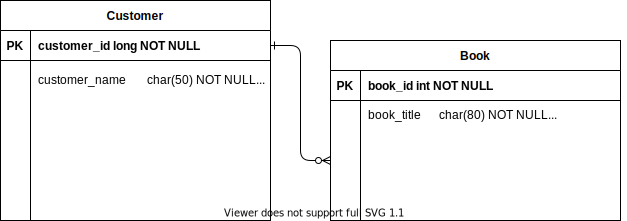

# 📚 REST API library client management system with Spring Boot 🍃
##### REST API developed during [Avanade's Code Anywhere bootcamp](https://web.digitalinnovation.one/) in partheship with [Porto Digital](https://www.portodigital.org/home) of Recife, Pernambuco - Brazil, and cloud deployed through Heroku

[Deployment](https://dioapi-live.herokuapp.com/) 


#### **🎯 During this development, the following tasks were made:**

* Initial project setup with [Spring Boot Initialzr](https://start.spring.io/) 

* Database and entity modelling

  ``

* Developing CRUD operations to manage users using the REST architectural pattern (GET, POST, PUT and DELETE)

* Development of unit tests for functionality validation

* Cloud system deployment through Heroku

  

#### **🛠 Used technologies and Java Dependencies**

- Java 11
- Maven 3.8.1
- Spring Boot (2.2.6)
  - **Spring Boot DevTools**
  - **Spring Web**
  - **Spring Data JPA** 
  - **H2 Database**
  - **Spring Boot Actuator**
  - **Lombok Project**
- Git/GitHub
- Heroku for cloud deploy


#### 💻Modelagem do Banco de Dados H2



<div class="mxgraph" style="max-width:100%;border:1px solid transparent;" data-mxgraph="{&quot;nav&quot;:true,&quot;resize&quot;:true,&quot;toolbar&quot;:&quot;zoom layers lightbox&quot;,&quot;edit&quot;:&quot;_blank&quot;,&quot;xml&quot;:&quot;&lt;mxfile host=\&quot;app.diagrams.net\&quot; modified=\&quot;2021-06-13T23:37:05.904Z\&quot; agent=\&quot;5.0 (Windows NT 10.0; Win64; x64) AppleWebKit/537.36 (KHTML, like Gecko) Chrome/91.0.4472.101 Safari/537.36\&quot; etag=\&quot;eRwTplg3PVeb0xNNLmRU\&quot; version=\&quot;14.7.7\&quot; type=\&quot;google\&quot;&gt;&lt;diagram id=\&quot;R2lEEEUBdFMjLlhIrx00\&quot; name=\&quot;Page-1\&quot;&gt;7Vvrc9o4EP9rmOl9SMfYYMjHQJLm5sg1l/Qec186wha2JkLyyeLVv/5WD4NfENMALU1nGGKtVrvS/nZXK6y0vOF0+UGgJL7nIaYt1wmXLe+65bp+rwffirAyBK/XN4RIkNCQ2hvCE/mCLdGx1BkJcVpglJxTSZIiMeCM4UAWaEgIviiyTTgtak1QZDU6G8JTgCiusP1NQhkbar+b477DJIozzW3H9oxR8BwJPmNWH+MMm54pysRY1jRGIV8USHgpbzmTdvIPWEwRw0xCzz0Sz1i0ujexlMoGVy33Fj4Txf0+4jyiGCUkfR/wKZCDFFhuJ2hKqAIgJ2hgBYE676blDQXn0jxNl0NMFYgZQGZOt1t61xYSSm6DAcOL+Wr07Eh2t/D+kvf30UNvfGGlzBGdWctb28hVBgUOARnbBFVErh4xRZJwdrPpGWAWXincgenm8QsW/BO/RwwWP0glEnLTp/DQ7LcEpuddtzMW23agXV1a5oNIRFjuWI9vcQyjvCNZg3zAfIqlWAHDYuNUa9eJ8w6VEYVe67zolsg6SLQWuNbxwIn2FxuI3qWVY+Ow3e8WRaR8JgJsR+XRKwnqdIqC/MxlM0HGNBVB8JBb+IaknWMPR3ErjjLg/LniLBBTiXqUaKzdQiNr04unoIWEIRFhEAEG+oBTipKUaHZDiQkNR2jFZzITlLUGE7LE4aPJLooXnGoEwlLrNyoaM1dV3YiSiMFzAH6kNA4ETmEuI5RKy7HV0+ZYSLzc6UMZMt0yxLad8zH3ss7H+s52dyrgty9Y3stRnQEFS5cE0UdI4ohFGrMiJMquoeDJpyz0FCFRbobFzRybZKmND/E75JQrZJmJcs2mF9cdwAeWO3Ted1tdmMAQ2u1NGz6KXcghZ6kUiGg4MAC1wAqsgeSJ1UPxJJuGsMZUz2MuJeTebbDudOqXsc620YbQesdCtlNB9uG3fbDlsNYJ1ak4JmGImQlJtYejDd41UNbaf23zMhjlQGyIh9cYjxwA3int363Yfwxp8DOMGbqtK8ek7N8/flLff45GrXWt8T2hk6VFwztIExQQFo3MSL8EX/cY8C1bW8PJPyWc/ltOlPWV1mESpd90DyyXMQeDtvcqaE8UicqgBE49VzYi9eimoPiNQXkhWx4PhP45gPBiOjwRSnsmxeOh5lbrx+EsBeOZc+tbL/jXhs8K/k4NYr0axNzjIVatC9/QRrZPxd+8RtlR8teBe7Qaxa3WnD9Szb923e+36HerZWJg86Gq/F2Hcha94bp/Dwh37HGdk0L6uvLwzBPmPpX/3gmzrvSvS5ht/2jgnkXZ2RSAXmMAXirzj2fwy3Mw+Ivp7/CI7JnuDoLQx39S7+7Dr9HFH/+uVgm+nsR3Ue17Hp8qM4RkDo+R1Os3JLAMK4Dn/zfj0u4PF9lbrSu9yfloag5DnteBvzGmc6wOS5WejZRM3XoPZWiK1/xsnJphzteRghiJd13nl9J+bFYGtjOLKy4YyDVm+HaWydSNRc1Mmy9g62wDE0ZqniIav3P0fMGxnNyTMqCx8OvWlheS6nOhEtF2k2Wpz8xSdTIupogWuxc2TFR/x8xTd1IsYZe9sMFcOx6CVF4QFuqoVv1OTrfuhN2UpRMYlY1X74wtw4KLsCg+PzwkaUKRtQthlORGQkpDMi9xG8xboSvFSZBMDhYmewRTu3PMYDqoxze1pLp9UFn9Tn1bY2kRE4m1g1jvTUQ91BASlzv11E4nz6PfLuw167PAIgwFTtPG3qhT09mvOolNSjiJc32bPfFwkfFD6qk3cIW5VEbrq004tCWtntKTmdH1QiAVJbGcZvdqKBpjOljfiCpVzzUFNZwr+TMuEet//i5V04f4XbXrF35XdZ1uw5Nk+1hls/sdls36hbMkkr6qZj5d3un/rMW/vb9EmAl8QuQzfW8d9p9HMM1y7kcwHUNoJmMummXYE1Rcx0pPagf/HCK59YR07Nxhdf8skmpvm/ZLRVLdy+e66wJfcdkUmpvr6eYi8eafDbyb/wE=&lt;/diagram&gt;&lt;/mxfile&gt;&quot;}"></div>
<script type="text/javascript" src="https://viewer.diagrams.net/js/viewer-static.min.js"></script>


### 📲 Quick start guide and making requests

To run the project on the terminal, type the following command:


a

 `mvn spring-boot:run ` 


By default, the server will start on port 9090. If you want it to start on default port 8080, you should go to aplication.properties and delete the line referring to "server port"


```English
MIT License

Copyright (c) 2021 Gustavo Nascimento

Permission is hereby granted, free of charge, to any person obtaining a copy
of this software and associated documentation files (the "Software"), to deal
in the Software without restriction, including without limitation the rights
to use, copy, modify, merge, publish, distribute, sublicense, and/or sell
copies of the Software, and to permit persons to whom the Software is
furnished to do so, subject to the following conditions:

The above copyright notice and this permission notice shall be included in all
copies or substantial portions of the Software.

THE SOFTWARE IS PROVIDED "AS IS", WITHOUT WARRANTY OF ANY KIND, EXPRESS OR
IMPLIED, INCLUDING BUT NOT LIMITED TO THE WARRANTIES OF MERCHANTABILITY,
FITNESS FOR A PARTICULAR PURPOSE AND NONINFRINGEMENT. IN NO EVENT SHALL THE
AUTHORS OR COPYRIGHT HOLDERS BE LIABLE FOR ANY CLAIM, DAMAGES OR OTHER
LIABILITY, WHETHER IN AN ACTION OF CONTRACT, TORT OR OTHERWISE, ARISING FROM,
OUT OF OR IN CONNECTION WITH THE SOFTWARE OR THE USE OR OTHER DEALINGS IN THE
SOFTWARE.
```

